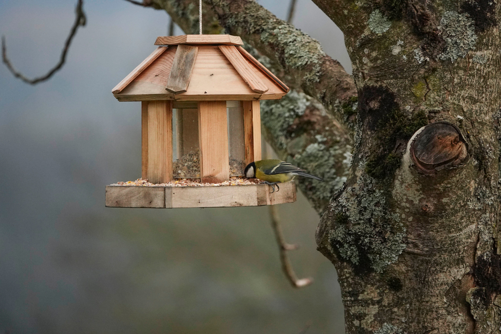

# Backyard Bird Classification & Detection (FeederWatch Automation)

*A species classification system for backyard feeder birds.*

---

## Table of Contents
- [Project Overview](#project-overview)
- [Objectives](#objectives)
- [Data Sources](#data-sources)
  - [Dataset Details](#dataset-details)
- [Methodology](#methodology)
  - [1. Data Preparation](#1-data-preparation)
  - [2. Modeling](#2-modeling)
  - [3. Evaluation & Interpretability](#3-evaluation--interpretability)
- [Deployment](#deployment)
- [Recommendations](#recommendations)
- [Future Work](#future-work)
- [File Structure](#file-structure)
- [Requirements](#requirements)
- [Acknowledgments](#acknowledgments)

---

## Project Overview

This project focuses on classifying bird species from backyard feeder images using a fine-tuned deep learning model. The goal is to support citizen science efforts like **[FeederWatch](https://feederwatch.org/)** by automating species logging and improving observation accuracy. A real-time version of this pipeline runs on a Raspberry Pi 5 with a Hailo-8 AI accelerator, enabling live detection, classification, and review.

---

## Objectives

- **Primary Goal**: Classify common North American feeder birds using real-time inference.
- **Supporting Goals**:
  1. Build an accurate and efficient classifier trained on fine-grained bird species.
  2. Use interpretability tools to explain model decisions.
  3. Streamline species logging for the FeederWatch program.

---

## Data Sources

The classifier was trained using a filtered and curated subset of the NABirds dataset. The subset was chosen based on the [Cornell University Common Feeder Birds List](https://feederwatch.org/learn/common-feeder-birds/)

### Dataset Details

- **Source**: [NABirds dataset](https://dl.allaboutbirds.org/nabirds)
- **Subset Source**: [Backyard Feeder Birds](https://www.kaggle.com/datasets/jakemccaig/backyard-feeder-birds-nabirds-subset)  
- **Subset**: 134 species selected based on frequency at North American feeders
- **Image Count**: 13,252 total images across all classes  
- **Image Size**: Resized to 600×600 for model training  
- **Augmentations**: Color jitter, crop, rotation, horizontal flip  

---

## Methodology

### 1. Data Preparation
- Resized and standardized all input images to 600×600 resolution.
- Applied image augmentations to simulate natural variability.
- Used stratified 80/20 train-validation split.

### 2. Modeling
- **Baseline**: Custom CNNs trained from scratch to establish a performance floor.
- **Final Model**: EfficientNet-B7 with transfer learning (ImageNet pretrained).
- **Export Format**: ONNX, optimized for Raspberry Pi inference with ONNX Runtime.
- **Training Pipeline**:
    - Used class weights (not weighted sampling) to mitigate imbalance
    - Early stopping based on validation accuracy
    - Mixed precision for faster training

### 3. Evaluation & Interpretability

- **Validation Accuracy**: 92.5%
- **Macro F1 Score**: 0.920
- **Validation Split**: Stratified 80/20 across 134 classes, preserving class balance.
- **Evaluation Strategy**: Used class-balanced weights and ONNX-exported models to reflect final deployment conditions.

**Grad-CAM**

- Correct classifications: The model consistently focused on the full bird—wings, body, tail—capturing key identification features.
- Misclassifications: Model attention was limited to heads or backgrounds, often missing distinguishing traits.
- These findings were especially useful for identifying weak spots in the model’s generalization to occluded or off-angle birds.

**LIME**

- Correct classifications: Saliency maps emphasized meaningful parts of the bird’s anatomy.
- Misclassifications: LIME highlighted non-informative areas like branches, shadows, or clutter.
- Interpretation revealed that some failures occurred not due to species confusion, but due to the model overemphasizing background artifacts.

These interpretability tools helped confirm that model success depends heavily on visibility of the full bird and minimal background distractions.

---

## Deployment

This system runs fully autonomously and has greatly improved the consistency of my FeederWatch observations. It captures timestamped visits, classifies species with high confidence, and drastically reduces species identification errors prior to logging in FeederWatch.

The deployed system is live and continuously improving. Source code and latest updates available at:
**[github.com/n2b8/birdwatcher](https://github.com/n2b8/birdwatcher)**

### System Architecture
- **Detection**: YOLOv8 (Hailo-optimized) runs in real time to detect birds.
- **Classification**: EfficientNet-B7 ONNX model classifies detected frames.
- **Web Dashboard**: Flask app with image logs, species charts, and a review interface.
  - `/` — Visit gallery showing all high-confidence classifications
  - `/review` — Interface for confirming or rejecting lower-confidence predictions
  - `/stats` — Includes species frequency bar charts and hour-by-day visit heatmap
- **Database**: SQLite stores all visit metadata and prediction confidence.
- **Notifications**: Telegram bot alerts for high-confidence visits.
- **Backups**: Daily image and database syncs to MinIO (S3-compatible).
- **Service Management**: All core components run as `systemd` services.

This system has already made my FeederWatch logging much easier and more consistent, automatically recording species, timestamps, and confidence scores.

---

## Recommendations

Based on evaluation and deployment testing, the following steps could improve system accuracy and flexibility:

1. **Add More Real-World Variability**:
   - Include birds in poor lighting, partial occlusion, and motion blur.
   - Expand to more feeder environments (urban, wooded, snowy, etc.).

2. **Enhance Classification Pipeline**:
   - Incorporate multi-frame or multi-angle classification support.
   - Explore attention-enhanced architectures for better localization.

3. **Deploy Beyond Backyard**:
   - Pilot in community parks or schools to increase usage and feedback.
   - Integrate with broader FeederWatch or iNaturalist APIs for validation.

4. **Model Monitoring**:
   - Integrate feedback loop from /review interface for retraining.
   - Periodically audit underperforming classes via Grad-CAM/LIME.

---

## Future Work

- Add support for multi-bird classification per frame.
- Retrain on seasonal and region-specific species groups.
- Build a mobile or web app for tagging and reporting visits.
- Publicly host the model on Hugging Face or Kaggle for reproducibility.

---

## File Structure

- **[images](/images)**: Directory for saved images
- **[index.ipynb](index.ipynb)**: Full analysis notebook following CRISP-DM
- **[presentation.pdf](presentation.pdf)**: Keynote slide deck

### External Files

- **[Custom Trained Model (EfficientNet-B7)](https://www.kaggle.com/models/jakemccaig/backyard-birds-efficientnet-b7)**: Final ONNX model trained on feeder bird subset
- **[Birds Dataset (NABirds Subset)](https://www.kaggle.com/datasets/jakemccaig/backyard-feeder-birds-nabirds-subset)**: Filtered NABirds subset used for training and evaluation

## Requirements

- **Python 3.10+**
- **Core Libraries**:
  - numpy, pandas, matplotlib, seaborn
  - torch, torchvision
  - onnxruntime

---

## Acknowledgments

- Dataset: [NABirds](https://dl.allaboutbirds.org/nabirds)
- Deployment: Raspberry Pi 5 + Hailo-8 AI Hat
- Citizen science inspiration: [FeederWatch](https://feederwatch.org/)
